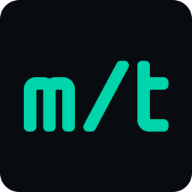
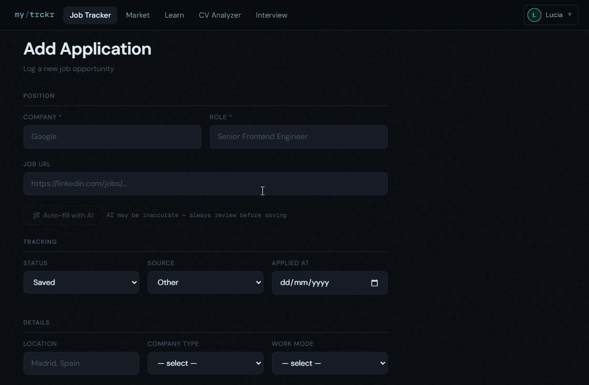
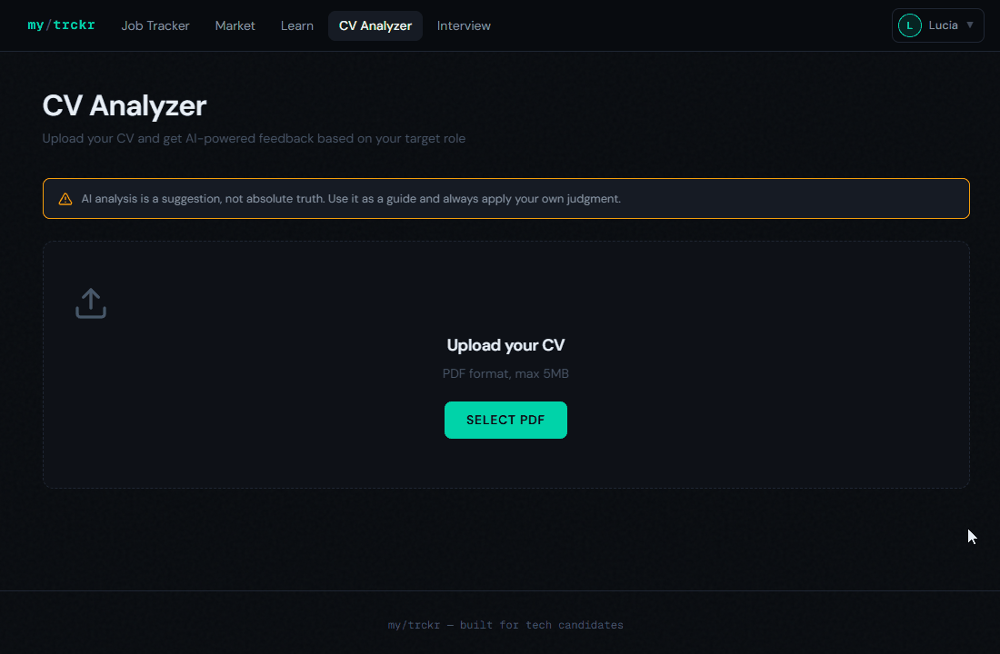
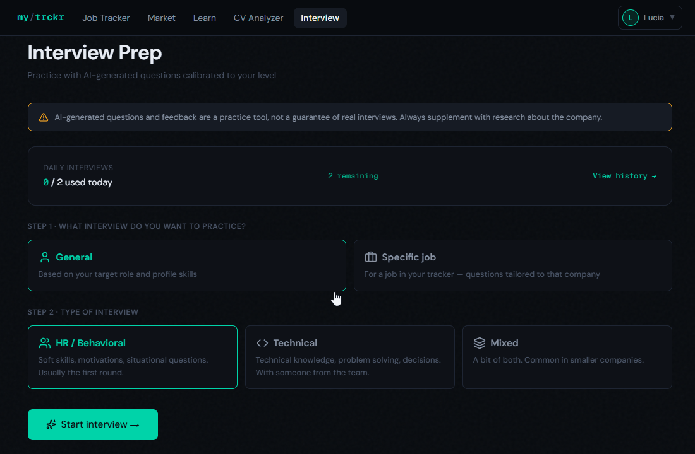
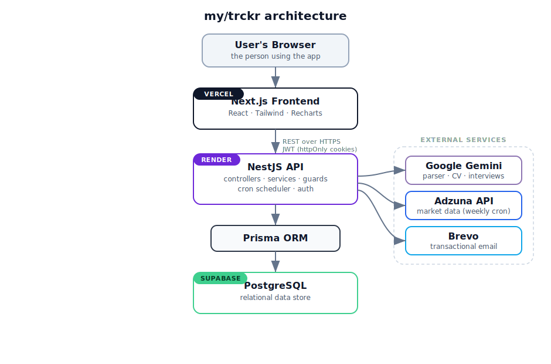

<!-- ============================================================
     HERO
     ============================================================ -->
<p align="center">
  
</p>

<h1 align="center">my/trckr</h1>

<p align="center">
  <i>Your AI-powered companion for the job search.</i>
</p>

<!-- ============================================================
     BADGES
     ============================================================ -->
<p align="center">
  <a href="https://github.com/luciaSeo02/mytrckr/actions/workflows/ci.yml">
    
  </a>
  
  
  
  
  
  
</p>

<!-- ============================================================
     LIVE DEMO CTA
     ============================================================ -->
<p align="center">
  <a href="https://mytrckr.vercel.app">
    
  </a>
</p>

<p align="center">
  <b>Track your job hunt. Sharpen every application. Land the interview.</b>
</p>

<p align="center">
  
</p>

---

## Why I built this

I've spent the past year job hunting. If you've done it too, you know how quickly it turns into a mess of spreadsheets, half-finished applications, and interviews you didn't feel ready for.

my/trckr is the tool I wished I had. I built it to bring some order to my own search, and to lean on AI where it actually helps: parsing job posts, sharpening my CV, and practicing interviews before the real thing. Along the way it became how I sharpened my full-stack skills too.

It helped me. I hope it helps you.

---

## AI features

The parts that do the heavy lifting for you.

### Job listing auto-parser
Paste a job posting URL and let AI extract the role, company, requirements, and key details straight into a structured application. No more copy-pasting field by field.

<p align="center">
  
</p>

### CV analyzer
Upload your CV (PDF) and get calibrated, experience-aware feedback: the kind of honest read you wish a mentor had time to give you before every application.

<p align="center">
  
</p>

### Interview simulator
Practice real interviews (general or role-specific, HR, technical, or mixed) in a chat-style session, then get feedback on how you did. Walk into the real thing already warmed up.

<p align="center">
  
</p>

---

## Platform features

### Job application tracker
Log every job you apply to with status, source, salary range, required skills, work mode, company type and more. Filter, sort and visualize your pipeline.

### Professional profile
Build your skills inventory with experience levels, target role, location and career goals. Your profile drives personalized insights across the entire app.

### Market insights
Real-time analytics on the European tech job market powered by Adzuna. See which skills are most in demand by region, role distribution, work-mode trends and average salaries, updated weekly from real listings.

### Skill gap analysis
Compare your profile against actual market demand. See exactly which skills you have, which you're missing, and your overall coverage percentage for your target role.

### Personalized recommendations
A learning path tailored to your profile and market data. Each recommendation includes priority level, market-demand stats and curated resources (docs, courses, tutorials, roadmaps). Track your progress and add learned skills to your profile in one click.

### Dashboard analytics
Visualize your entire job search: applications by status, source and company type, plus an at-a-glance view of your next learning step and market coverage.

### Authentication & security
Secure JWT-based auth with httpOnly cookies, email verification on signup, password reset via email, change password from profile, and account deletion.

---

## Coming soon

- **AI cover letter generator** for tailored letters per job offer
- **AI career coach** that guides you based on your profile and market trends

---

## Tech stack

| Layer | Tech |
|-------|------|
| **Frontend** | Next.js 16 (App Router, Turbopack), TypeScript, Tailwind CSS v4, Recharts, Lucide icons |
| **Backend** | NestJS (TypeScript), Prisma ORM, JWT auth with httpOnly cookies |
| **Database** | PostgreSQL (Supabase in production) |
| **AI** | Google Gemini (`gemini-2.5-flash`) |
| **Integrations** | Adzuna API (market data), Brevo (transactional email), scheduled cron syncs |
| **Deployment** | Vercel (frontend) · Render (backend) · Supabase (database) |

---

## Architecture

<p align="center">
  <picture>
    
  </picture>
</p>

A Next.js frontend on Vercel talks to a NestJS REST API on Render, which persists data through Prisma to a PostgreSQL database on Supabase. AI features call the Google Gemini API, market data comes from Adzuna via weekly cron syncs, and transactional emails are sent through Brevo.

---

## Getting started

> my/trckr is a deployed app, so the fastest way to try it is the **[live demo](https://mytrckr.vercel.app)**. These steps are for developers who want to run it locally.

### Prerequisites
- Node.js 18+
- Docker Desktop (for local PostgreSQL)

### Backend
```bash
cd backend
npm install
 
# Start PostgreSQL locally
docker-compose up -d
 
# Set up environment variables
cp .env.example .env
# Fill in your own values (DATABASE_URL, JWT_SECRET, GEMINI_API_KEY, BREVO_API_KEY, ADZUNA_APP_ID, ADZUNA_APP_KEY, ...)
 
# Run migrations & seed
npx prisma migrate dev
npm run seed
 
# Start dev server
npm run start:dev
```

### Frontend
```bash
cd frontend
npm install
cp .env.example .env.local   # set NEXT_PUBLIC_API_URL to your backend URL
npm run dev
```

---

## License

Released under the [MIT License](LICENSE).
